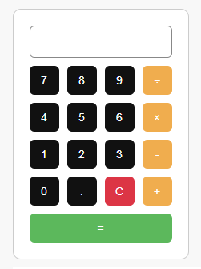
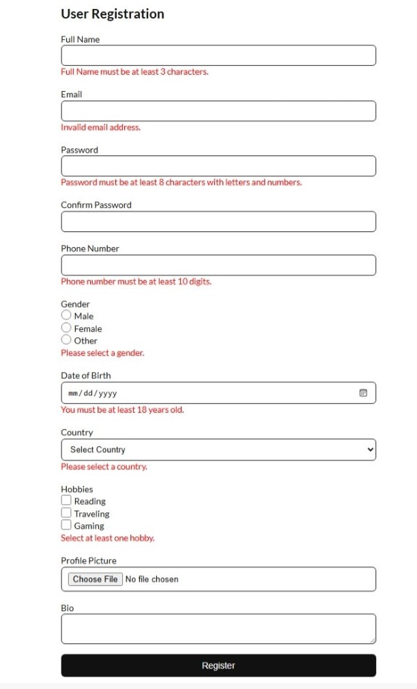

# Homeworks

## 1. Build a Calculator with React + TypeScript

Build a simple calculator application using **React**, **TypeScript**, and **CSS Modules**, based on a given UI layout.



### 📝 Requirements:

#### ✅ Functional Requirements:

1. The calculator should perform **basic arithmetic operations**:

   * Addition (`+`)
   * Subtraction (`-`)
   * Multiplication (`×`)
   * Division (`÷`)
2. Display the current expression and result in a read-only screen.
3. Support input using on-screen buttons only (no keyboard input required).
4. Buttons include:

   ```
   7 8 9 ÷
   4 5 6 ×
   1 2 3 -
   0 . C +
         =
   ```
5. Use `"C"` to clear all input, and `"="` to compute the result.
6. Prevent invalid inputs such as multiple decimal points in a number.
7. Division by zero should display `"Error"`.

#### 🔧 Technical Requirements:

* Use **React Functional Components**.
* Use **TypeScript** for type safety.
* Use **CSS Modules** for styling.
* Use `useState` to manage operands and operator state.
* Do **not use any third-party libraries** for UI or form handling.

---

### 🎨 UI Guidelines:

* Layout buttons in a 4-column grid.
* Highlight operator buttons (e.g., with a different color).
* The display area should clearly show the current expression.
* "=" button should span the full width of the row (4 columns).

---

### 📁 Suggested Folder Structure:

```
src/
├── components/
│   └── Calculator.tsx
│   └── Calculator.module.css
├── App.tsx
├── main.tsx
```

---


## 2. User Registration Form in React + TypeScript

Build a **responsive and accessible user registration form UI** using **React**, **TypeScript**, and **CSS Modules**, based on the layout and behavior shown in the provided image.


---

### 📋 Form Field Requirements

| **Field**        | **Type**    | **Validation Rules**                                                       |
| ---------------- | ----------- | -------------------------------------------------------------------------- |
| Full Name        | Text        | At least **3 characters**                                                  |
| Email            | Email       | Must be a **valid email format**                                           |
| Password         | Password    | At least **8 characters** and must contain **letters and numbers**         |
| Confirm Password | Password    | Must **match** the password                                                |
| Phone Number     | Tel         | Must be at least **10 digits**                                             |
| Gender           | Radio       | Must select one: **Male / Female / Other**                                 |
| Date of Birth    | Date        | User must be at least **18 years old**                                     |
| Country          | Select      | Must select a country from the dropdown                                    |
| Hobbies          | Checkbox    | Must select **at least one hobby** (Reading / Traveling / Gaming)          |
| Profile Picture  | File Upload | Must be a valid **.jpg, .jpeg, or .png** image file                        |
| Bio              | Textarea    | Optional, max length **300 characters** (bonus: show remaining characters) |

---

### ❗ Error Display Requirements:

* Show validation error messages **in red**, **below each field**.
* Example: `“Full Name must be at least 3 characters.”`

---

### 💡 UI & Styling Guidelines:

* Style the form using **CSS Modules** only. (❌ No Bootstrap, Tailwind, or third-party UI libraries)
* Each label should appear **above its corresponding input**.
* The `Register` button must be clearly styled and placed at the bottom.
* The form must be **responsive** and **keyboard accessible**.

---

### 🔧 Technical Requirements:

* Use **React Functional Components** and **TypeScript**.
* Use `useState` for managing form and validation state.
* Do **not use** any form libraries (e.g., Formik, React Hook Form).
* File upload should be handled with `<input type="file" />` and validated manually.

---

### 📁 Suggested Folder Structure:

```
src/
├── components/
│   └── RegistrationForm.tsx
│   └── RegistrationForm.module.css
├── App.tsx
├── main.tsx
```

## 3. Build a Simple Shopping Cart in React + TypeScript

Dưới đây là **đề bài bằng tiếng Anh** cho bài tập lập trình **giỏ hàng đơn giản** sử dụng **React + TypeScript + CSS Modules**, mô phỏng theo hình ảnh bạn cung cấp.

---

## 🛒 Assignment: Build a Simple Shopping Cart in React + TypeScript

Create a shopping cart UI that displays a grid of products and allows users to add/remove items from the cart. Clicking the cart icon should show a dropdown with the selected items, their quantity, and total price.

Example Demo:


---

### 📦 Product Data

You will be provided with a static array of products like this:

```ts
const products = [
  { id: 1, name: "Knorr Demiglace Sauce Powder 1kg", price: 315000 },
  { id: 2, name: "Kikkoman Soy Sauce 1L", price: 180000 },
  { id: 3, name: "Do Luong Rice Paper (5 pcs)", price: 25000 },
  { id: 4, name: "Lea & Perrins Worcestershire Sauce 290ml", price: 150000 },
  { id: 5, name: "Thuan Phat Dipping Sauce", price: 22000 },
  // ...add more if needed
];
```

You do **not** need to display product images (no thumbnails required).

---

### 🧩 Requirements

#### 🔲 Product Grid

* Display the list of products in a **4-column grid layout**.
* Each product card should include:

  * Product name
  * Price (formatted with thousand separator and "₫")
  * Quantity selector (buttons `+`, `-`, and quantity in the middle)
  * Add to cart button or automatically add on `+` click

#### 🛒 Cart Icon & Dropdown

* Show a **cart icon** (🛒 or SVG) at the top right with total number of items.
* When clicked, it should toggle a **dropdown panel** with:

  * List of products in the cart
  * Quantity per item
  * Individual and total price
  * "Remove" (❌) button for each product
  * Total price at the bottom
  * "View Cart" button (no navigation needed)

#### 🔧 Functionality

* Quantity increases by clicking `+`, decreases with `-`
* If quantity reaches 0, product should not be in the cart
* Removing item from dropdown should update the cart
* Cart updates in real-time with quantity and total price
* All data stays in memory (no backend required)

---

### 💅 Styling Guidelines

* Use **CSS Modules** for styling
* The UI should be **clean and responsive**
* Cart dropdown should align right under the icon and float above the content
* Price should be formatted properly (`315000 → 315.000 ₫`)
* Use consistent spacing and padding

---

### 🛠 Technical Requirements

* Use **React Functional Components**
* Use **TypeScript**
* Use `useState`, `useContext` to manage cart state

---

### 📁 Suggested Folder Structure

```
src/
├── components/
│   ├── ProductGrid.tsx
│   ├── CartDropdown.tsx
│   ├── CartIcon.tsx
│   └── ProductCard.tsx
├── App.tsx
├── types/
│   └── Product.ts
├── data/
│   └── products.ts
```

